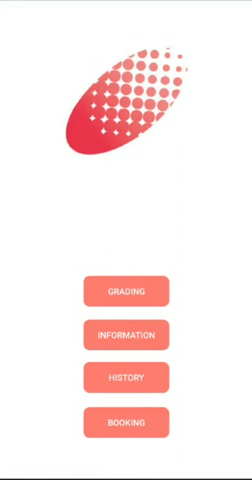

# Eacne - Acne Severity Grading Beta App

## What's Eacne ?
Eacne is a cross platform beta app to help dermatologists assess patients' acne conditions.

3 grades output based on acne severity of patients:
- Grade 0: Clean
- Grade 1: Mild
- Grade 2: Severe

## What's special about Eacne ?
Eacne is powered by a lightweight classification neural network
- Customised neural net called MAGNet designed from first principle
- MAGNet runs directly on mobile CPU
- Patients' images are not routed to a central database for processing -> ensure better privacy

## How did we make Eacne ?
### Our published research work
> ### Automated grading of acne vulgaris by deep learning with convolutional neural networks
> #### Skin Research & Technology. 2020; 26: 187– 192. https://doi.org/10.1111/srt.12794
> Ziying Vanessa Lim, Farhan Akram, Cuong Phuc Ngo, Amadeus Aristo Winarto, Wei Qing Lee, Kaicheng Liang, Hazel Hweeboon Oon, Steven Tien Guan Thng, Hwee Kuan Lee

### Our technical report how we design Mobile Acne-severity Grading Network (MAGNet): [(full link)](https://drive.google.com/file/d/16fMoO-TsQ8kdw0IQVeG4sEh6rHxWNLVi/view?usp=sharing)

### MAGNet Summary Poster: [(full link)](https://drive.google.com/file/d/12eHP8VXvuZFE5Z81SLjhBBwN3pj9_DGv/view?usp=sharing)

## Acknowledgement
Singapore National Skin Center (NSC) [(link)](https://www.nsc.com.sg/Pages/index.aspx) for provision of data, acne annotation guide and research collaboration.
