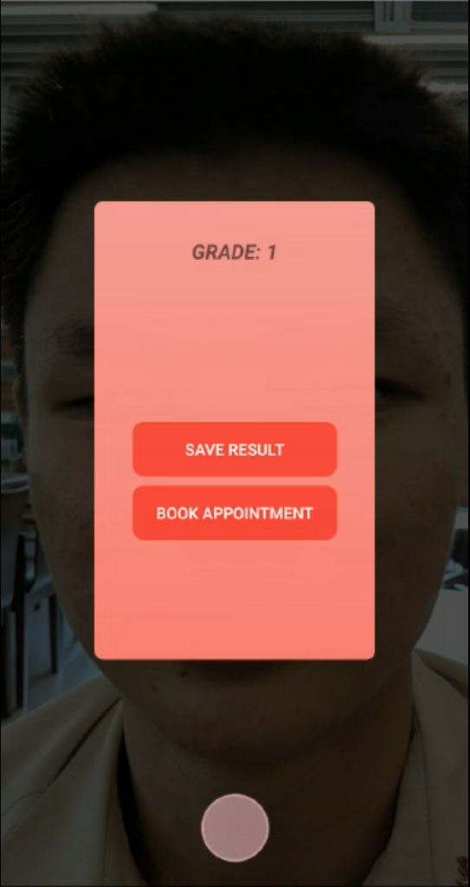

# Eacne - Acne Severity Grading Beta App

## What's Eacne ?
Eacne is a cross platform beta app to help dermatologists assess patients' acne conditions.

3 grades output based on acne severity of patients:
- Grade 0: Clean
- Grade 1: Mild
- Grade 2: Severe

## What's special about Eacne ?
Eacne is powered by a lightweight classification neural network
- Customised neural net called MAGNet designed from first principle
- MAGNet runs directly on mobile CPU
- Patients' images are not routed to a central database for processing -> ensure better privacy